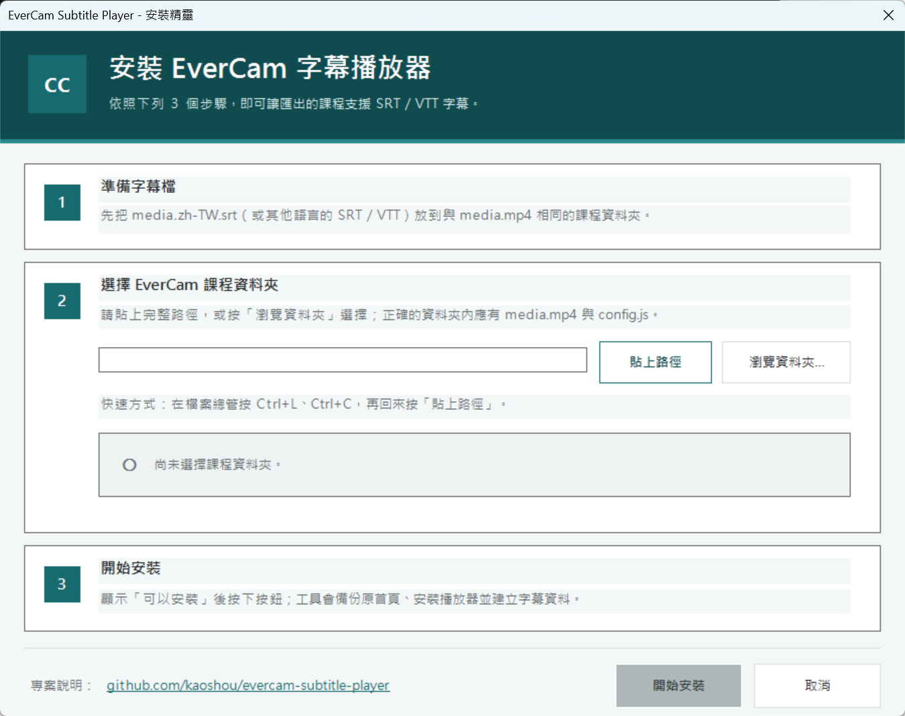
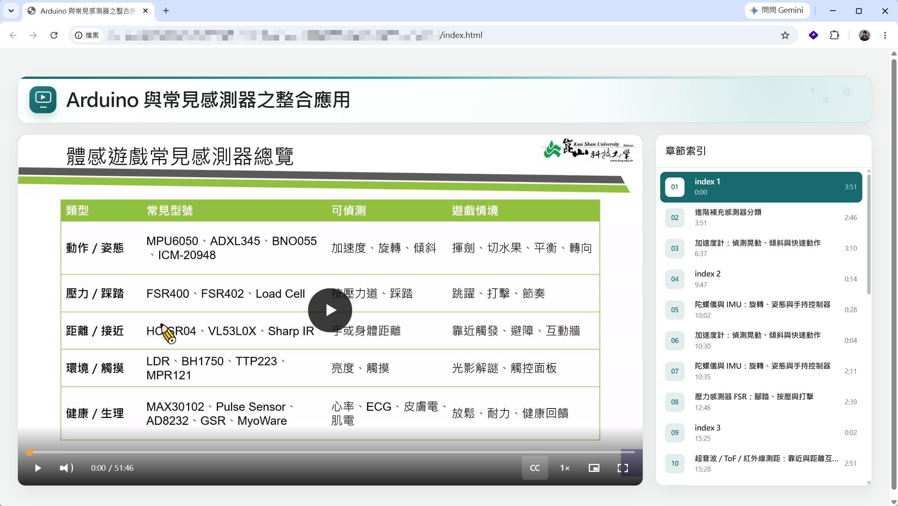

# EverCam Subtitle Player

**EverCam 網頁課程字幕播放器（非官方）**

讓 EverCam 匯出的網頁課程快速支援 SRT、VTT、多國語字幕，以及適合桌機與手機使用的現代化播放器。

- 目前版本：`1.0.4`
- 專案網址：[github.com/kaoshou/evercam-subtitle-player](https://github.com/kaoshou/evercam-subtitle-player)
- 工具使用環境：Windows 10／11
- 影片播放環境：支援 HTML5 Video 的現代瀏覽器
- 開發人員：崑山科技大學 鄭郁翰
## 專案緣由

本專案是因為本人使用 EverCam 錄製數位課程時，希望在匯出的網頁版課程掛載字幕(而且有鑑於境外學生日益增多，需要支援多國語系切換)，卻遇到原始播放器無法直接加入 SRT、VTT 與多國語字幕的問題，因此開發了 EverCam Subtitle Player。

目標是讓教師不必重新剪輯影片，也不必修改網頁程式，只要「放入字幕、選擇課程資料夾」，就能完成可離線播放、保留章節索引並支援字幕的數位教材。

## 三步驟完成安裝

先從 GitHub Releases 下載並解壓縮 `evercam-subtitle-player-v1.0.4.zip`。請保持安裝套件內的檔案結構，不要只取出其中一個檔案。

### 1. 準備字幕

將字幕檔放進 EverCam 課程資料夾，與 `media.mp4`、`config.js` 放在同一層：

```text
你的 EverCam 課程資料夾/
├─ media.mp4
├─ config.js
├─ index.html
└─ media.zh-TW.srt       你準備的字幕
```

### 2. 開啟安裝精靈

回到解壓縮後的安裝套件，雙擊：

```text
安裝字幕播放器.cmd
```

將 EverCam 課程資料夾的完整路徑貼進安裝精靈，或按「瀏覽資料夾…」選擇。也可以把課程資料夾直接拖曳到 `安裝字幕播放器.cmd`。

> `安裝字幕播放器.cmd` 必須和安裝套件內的 `player`、`scripts` 資料夾放在一起，不要單獨複製到課程資料夾。

### 3. 開始安裝

狀態區顯示綠色的「可以安裝」後，按「開始安裝」。工具會自動備份原始首頁、安裝播放器、建立字幕資料並開啟課程。



> 圖片為操作流程示意；實際外觀可能隨版本微調。

安裝完成後，直接開啟課程資料夾內的 `index.html` 即可播放。

## 字幕檔名規則

多國語字幕使用以下格式：

```text
media.語言代碼.srt
media.語言代碼.vtt
```

例如：

```text
media.zh-TW.srt     正體中文
media.en.vtt        英文
media.ja.srt        日文
```

請注意：

- 同一種語言只能保留一個字幕檔，例如不可同時放置 `media.en.srt` 與 `media.en.vtt`。
- 只有單一正體中文字幕時，可簡化為 `media.srt` 或 `media.vtt`。
- 只有在資料夾內不存在 `media.zh-TW.srt`／`media.zh-TW.vtt` 時，`media.srt`／`media.vtt` 才會被視為正體中文（`zh-TW`）。
- `media.srt` 與 `media.vtt` 不可同時存在。
- 字幕檔建議使用 UTF-8 編碼。

## 日後更新字幕

第一次安裝後，課程資料夾內會出現 `更新字幕.cmd`。日後新增、刪除或修改字幕時：

1. 更新課程資料夾內的字幕檔。
2. 雙擊 `更新字幕.cmd`。
3. 完成後重新載入 `index.html`。

不需要再次複製播放器檔案，也不需要修改 `config.js`。

## 字幕載入與設計原理

播放器**不會在開啟網頁時直接讀取 SRT 或 VTT 檔案**。安裝或更新字幕時，工具會先解析課程資料夾內的字幕，將時間、文字及語言整理到自動產生的 `subtitles-data.js`：

```text
media.zh-TW.srt／media.en.vtt
              ↓ 執行「更新字幕.cmd」
       subtitles-data.js
              ↓ 開啟 index.html 時載入
          網頁播放器字幕
```

網頁的載入順序如下：

1. `config.js`：讀取 EverCam 課程名稱、影片、作者及章節等資料。
2. `subtitles-data.js`：載入工具整理好的各語言字幕與時間資料。
3. `js/evercam-modern.js`：依照字幕資料建立瀏覽器的字幕軌，並提供字幕切換與外觀設定。

採用這種設計，是因為直接以 `file://` 開啟本機網頁時，瀏覽器通常會限制 JavaScript 即時讀取旁邊的 SRT／VTT 檔案。先轉換成 JavaScript 資料可以：

- 避免本機檔案存取與跨來源（CORS）限制。
- 不需架設網站伺服器，直接雙擊 `index.html` 即可離線播放。
- 將多國語字幕整理成一致格式，交由同一套播放器控制。
- 在一般播放、字幕外觀設定及子母畫面等模式共用字幕資料。

因此，**只修改、加入或刪除 SRT／VTT 並不會立即改變網頁字幕**。完成變更後必須再次執行 `更新字幕.cmd`，讓工具重新產生 `subtitles-data.js`，再重新載入網頁。請將 SRT／VTT 視為原始字幕檔，`subtitles-data.js` 則是自動產生的播放資料，不建議手動編輯。

若要將課程放到網站、隨身碟或其他電腦，請連同 `subtitles-data.js` 一起複製；否則播放器無法取得字幕內容。

## 執行畫面

左側為課程影片與播放器控制列，右側保留 EverCam 章節索引。



## 主要功能

- 支援 SRT、WebVTT（VTT）及多國語字幕切換。
- 自動讀取 EverCam 的課程名稱、封面、作者、影片長度與章節索引。
- 支援章節階層縮排與 `1`、`1.1`、`1.2` 等編號。
- 尊重 EverCam 的「隱藏索引序號」設定；隱藏序號時仍保留章節階層。
- 章節標題預設顯示一行，過長時以省略號收合；滑鼠移入或鍵盤焦點停留時會動態展開完整名稱。
- 點擊章節可跳到對應時間，目前章節會跟隨播放進度切換。
- 字幕大小、顯示樣式與位置可即時調整。
- 播放速度支援 `0.25×` 至 `5×`。
- 支援全螢幕、瀏覽器子母畫面及跨網域 iframe 內的全畫面備援模式。
- 響應式設計，可在桌機、平板及手機使用。
- 可直接離線開啟，不需架設網站伺服器。
- 不會將影片、字幕或觀看資料上傳到外部服務。

### 調整章節標題行數

開啟 `js/evercam-modern.js`，修改檔案開頭的設定值：

```javascript
var CHAPTER_TITLE_LINES = 1;
```

設為 `1` 顯示一行，改為 `2`、`3` 即可顯示兩行或三行；超出的文字會以省略號收合，滑鼠移入時再動態展開。

播放器會偵測 EverCam `config.js` 中的 `title`、`author.name`、`duration`、`hideSN`、`index[].indent` 等欄位。選用欄位不存在時會自動略過，不需要手動調整不同匯出格式。

## 學生端操作

- 從播放器的 `CC` 按鈕切換字幕語言、關閉字幕或調整字幕外觀。
- 從速度選單切換慢速、正常或快速播放。
- 瀏覽器與作業系統支援時，可使用子母畫面。
- 點擊右側或下方的章節索引可跳至該章節。

桌機鍵盤快捷鍵：

| 按鍵 | 功能 |
|---|---|
| `Space` | 播放／暫停 |
| `←`／`→` | 倒退／快轉 10 秒 |
| `M` | 靜音／恢復聲音 |
| `F` | 進入／離開全螢幕 |

## 常用語言代碼

本專案使用 BCP 47 語言標籤。一般語言可使用簡短代碼，需要區分文字系統或地區時再加入第二段標籤。(可支援srt或vtt副檔名格式)

| 語言 | 建議代碼 | 字幕檔名範例 |
|---|---|---|
| 正體中文（臺灣） | `zh-TW` | `media.zh-TW.srt`（亦可用 `media.srt`） |
| 正體中文（不限定地區） | `zh-Hant` | `media.zh-Hant.srt` |
| 簡體中文（中國大陸） | `zh-CN` | `media.zh-CN.srt` |
| 簡體中文（不限定地區） | `zh-Hans` | `media.zh-Hans.srt` |
| 英文 | `en` | `media.en.vtt` |
| 日文 | `ja` | `media.ja.srt` |
| 韓文 | `ko` | `media.ko.vtt` |
| 越南文 | `vi` | `media.vi.srt` |
| 印尼文 | `id` | `media.id.srt` |
| 西班牙文 | `es` | `media.es.vtt` |
| 法文 | `fr` | `media.fr.srt` |
| 德文 | `de` | `media.de.vtt` |
| 泰文 | `th` | `media.th.srt` |
| 馬來文 | `ms` | `media.ms.vtt` |

更多代碼可參考：[W3C Choosing a language tag](https://www.w3.org/International/questions/qa-choosing-language-tags) 與 [IANA Language Subtag Registry](https://www.iana.org/assignments/language-subtags-tags-extensions/language-subtags-tags-extensions.xhtml)。

## 常見問題

### 雙擊「安裝字幕播放器.cmd」後視窗立即消失

請確認下載的是 `v1.0.4` 或更新版本，並先將 ZIP **完整解壓縮**，不要直接在壓縮檔內執行，也不要只取出 `.cmd`。正確的套件資料夾內應同時包含 `player`、`scripts` 與「安裝字幕播放器.cmd」。

自 `v1.0.4` 起，若 PowerShell、WinForms 或套件檔案發生問題，命令視窗會保留並顯示錯誤碼與原因。請保留該畫面，依訊息檢查或將錯誤畫面附在 GitHub Issue。

### 「開始安裝」按鈕無法使用

安裝精靈選到的資料夾必須同時包含 `media.mp4` 與 `config.js`。請確認選擇的是 EverCam 匯出的課程資料夾，而不是安裝套件資料夾。

### 執行「更新字幕.cmd」時出現錯誤

請先檢查字幕檔名。同一語言不可同時存在 SRT 與 VTT，也不可同時放置 `media.srt` 和 `media.vtt`。修正後再次執行即可。

### 播放器沒有出現字幕

確認字幕已放在 `media.mp4` 同一層，檔名符合規則，並再次執行 `更新字幕.cmd`。播放時再從 `CC` 選單確認字幕語言沒有被關閉。

### 如何還原 EverCam 原始首頁

第一次安裝時，工具會將原始 `index.html` 備份為 `index.evercam-original.html`。請先保留整個課程資料夾備份；需要還原時，可將備份檔複製為 `index.html`。

### 為什麼沒有子母畫面或原生全螢幕

功能是否可用取決於瀏覽器、作業系統及 iframe 權限。原生全螢幕被跨網域 iframe 阻擋時，播放器會改為占滿 iframe 的可視範圍。

## 安裝完成後的資料夾

```text
你的 EverCam 課程資料夾/
├─ media.mp4                       EverCam 原有影片
├─ config.js                       EverCam 原有課程設定
├─ cover.jpg                       EverCam 原有封面（若有）
├─ index.evercam-original.html     原始首頁備份
├─ index.html                      新版播放器
├─ media.zh-TW.srt                 字幕，可有多個語言
├─ subtitles-data.js               工具自動產生
├─ 更新字幕.cmd
├─ 字幕使用說明.txt
├─ css/
├─ js/
└─ tools/
```

## 手動安裝（進階）

若無法使用一鍵工具，請先自行備份原始 `index.html`，再將 [`player`](player/) 資料夾**裡面的內容**複製到 EverCam 課程資料夾：

```text
index.html
subtitles-data.js
更新字幕.cmd
字幕使用說明.txt
css/
js/
tools/
```

請勿複製整個 `player` 資料夾，也不要刪除原有的 `media.mp4`、`config.js` 與封面檔。複製完成後，雙擊 `更新字幕.cmd`。

## 專案結構

```text
evercam-subtitle-player/
├─ README.md                       GitHub 專案說明
├─ CHANGELOG.md                    版本更新紀錄
├─ VERSION                         目前版本
├─ 安裝字幕播放器.cmd              教師使用的一鍵安裝入口
├─ 快速使用說明.txt                發行包內的精簡說明
├─ 商標與免責聲明.txt
├─ docs/images/                    README 圖片
├─ examples/                       SRT、VTT 格式與命名範例
├─ player/                         要安裝到課程資料夾的播放器
│  ├─ index.html
│  ├─ subtitles-data.js
│  ├─ 更新字幕.cmd
│  ├─ 字幕使用說明.txt
│  ├─ css/evercam-modern.css
│  ├─ js/evercam-modern.js
│  └─ tools/Build-Subtitles.ps1
└─ scripts/
   ├─ Install-Player.ps1           一鍵安裝核心
   └─ Build-Release.ps1            建立發行 ZIP
```

實際課程的影片、設定檔、封面與字幕不應提交到本專案儲存庫。

## 建立發行套件

專案維護者可在 Windows PowerShell 執行：

```powershell
powershell -ExecutionPolicy Bypass -File .\scripts\Build-Release.ps1
```

完成後會在 `release` 資料夾產生 `evercam-subtitle-player-v版本.zip`。發行包只保留教師安裝需要的檔案，不包含測試課程、影片或範例字幕。

## 商標與免責聲明

EverCam 為其權利人所有之商標。本專案名稱中的「EverCam」僅用於說明適用對象與相容用途，並非表示本專案的商品或服務來源。

本專案由崑山科技大學鄭郁翰獨立開發，屬非官方輔助工具，與 EverCam 的開發商、經銷商及商標權人之間不存在隸屬、授權、贊助、合作或背書關係。本專案不包含或重新散布 EverCam 軟體、授權金鑰或原廠專有程式。

工具依「現況」提供，不保證與所有 EverCam 版本或匯出格式相容。使用者應保留原始課程備份，並自行確認對影片、字幕及教材內容具有合法使用權。

完整內容請見 [`商標與免責聲明.txt`](商標與免責聲明.txt)。
